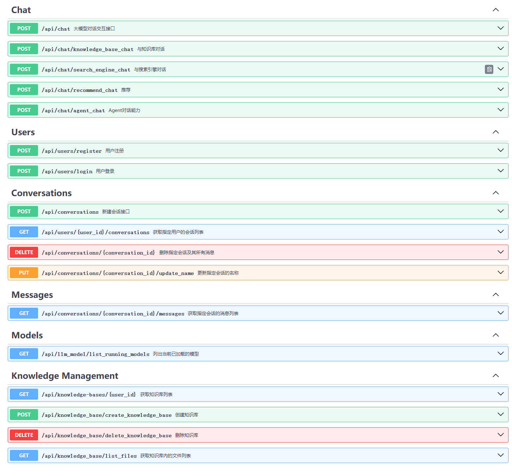

<div align="center">
  <h1>LLM Chat</h1>
</div>


## ⚡ 项目简介

LLM Chati 是一个基于大模型技术开发的本地知识库智能问答系统。本系统实现了目前大模型应用落地的五个核心场景：大模型通用领域知识问答、本地私有知识库问答、实时联网搜索问答、AI Agents 问答以及大模型推荐系统.
### 技术架构
本项目是在👉[LangChain-chatchat](https://github.com/chatchat-space/Langchain-Chatchat) 的基础上进行的二次开发，优化了原有的架构，使用了前后端分离的设计方案。后端全部使用Python开发语言，前端则采用了现代的Vue3框架。 该项目对接的前端开源仓库👉 [LLMchat-web](https://github.com/lyw912/LLMChat-web) 

### 主要特点
- **主流功能覆盖**：涵盖大模型通用知识问答、本地私有知识库问答、实时联网检索问答、AI Agents问答及大模型推荐系统。
- **数据预处理**：百万级Wiki公有语料、Markdown、PDF等类型的私有语料从0到1构建和精细化处理流程。
- **用户权限管理**：实现细粒度的用户访问控制，高效保障数据安全与隐私。
- **灵活接入基座大模型**：支持接入主流的在线和开源大模型，确保系统的适应性和前瞻性。
- **数据库整合**：集成关系型数据库和向量数据库，优化数据存取效率和查询响应时间。
- **高效且完整的RAG评估系统**：内置完整的RAG评估Pipeline，为模型评估和优化提供强有力的支持。参考👉[FlashRAG](https://github.com/RUC-NLPIR/FlashRAG)
- 
##  功能亮点

### 一、用户模块
LLM Chat 提供了一个完善的用户注册和登录机制，从而确保系统的安全性和用户的个性化体验。该模块的主要特点包括：
1. **用户注册**：允许新用户创建账户，注册后可通过前端登录界面进入系统。
2. **用户校验**：在前端进行初步的用户验证。非法用户将被阻止访问智能问答系统，确保系统的安全性。
3. **会话管理与知识库访问**：登录用户能够访问系统预置的会话及其个人创建的会话。同时，用户可使用自己的知识库进行问答，每位用户的数据访问被严格限定，用于保障个人数据的隐私性。

### 二、模型接入
LLM Chat 能够兼容多种高性能开源大模型、在线大模型API作为基座模型，该系统版本以 ChatGLM3-6b、glm-4-9b-chat 以及在线 GLM-4 API 接口为主。允许用户根据个人实际需求灵活接入其他模型，支持主流的 OpenAI GPT、Qwen2 等模型，以及 Vllm、Ollama 等接入框架。

#### 底层技术支持：
我采用了👉 [FastChat](https://github.com/lm-sys/FastChat) 开源项目框架来部署模型，优化了对 glm4-9b-chat 模型的支持。尽管 FastChat 框架尚未兼容 glm4-9b-chat，我已经手动修复了包括流式输出和自问自答重复循环等问题。现在，glm4-9b-chat 模型已经完全可用，并且表现稳定。

#### 扩展性：
为了方便用户扩展或测试新模型，我提供了详细的代码示例。通过这些示例，用户可以理解如何将新的模型集成到系统中，进一步增强系统的功能性和灵活性。

### 三、核心问答功能说明
#### 3.1 通用知识问答

LLM Chat 的通用知识问答功能充分利用了大模型的原生对话能力。本功能直接以大模型作为基础，结合 LangChain 应用框架，创建了一个统一的大模型会话接口。通过实时读取 MySQL 数据库中指定用户和对话窗口的历史对话记录，赋予大模型会话记忆能力。

##### 功能特点：
- **多轮对话支持**：用户可以进行连续的对话，系统将保持对话的上下文，增强对话的连贯性。
- **会话历史记忆**：通过记忆用户的历史对话，系统能够提供更加个性化和准确的回答，极大地增强用户体验。

#### 3.2 本地私有知识库问答

我在通用知识问答流程的基础上，引入了本地知识库的加载和检索功能，利用大模型 RAG 技术提升问答质量。此功能允许大模型接入私有数据，同时有效解决大模型知识局限性的问题。

##### 技术实现：
我采用 Faiss 数据库存储向量索引，为系统提供了高效的检索能力。系统预置了包括百万级 Wiki 公共语料和私有语料（ PDF 格式）的知识库，用于提升数据的广泛性和深度。

##### 功能特点：
  - **多轮对话支持**：允许在多个连续交互中始终保持对话的连贯性。
  - **历史记忆功能**：通过历史会话记录增强对话的个性化和相关性。
  - **系统提示角色**：增添系统提示角色以引导用户对话，提供更为人性化的交互体验。
  - **实时 Faiss 向量数据检索召回**：利用 Faiss 向量数据库进行快速高效的数据检索，优化答案的精准度。

#### 3.3 联网实时检索 + 私有知识库检索问答
此功能链路中集成了实时联网检索，这是当前在 AI 搜索中非常主流的一种大模型应用链路。我通过更加细节的流程处理去确保信息检索的效率和准确性，即便在国内网络环境下也能表现出色。

##### 实现流程：

1. **基于👉[Serper API](https://serper.dev/) 的 Google Search 信息检索**：使用 Serper API 构建的搜索能力，根据用户的查询（Query）实时检索网页信息。
2. **初步重排**：系统对初步检索结果进行筛选，选择与查询最相关的 Top N 网页信息。
3. **信息索引**：对筛选后的网页内容网页主题内容的规则化提取，而后进行索引处理，并存储到 Milvus 向量数据库中，为后续的检索操作做好准备。
4. **向量检索**：在 Milvus 向量数据库中执行检索，快速找到与用户查询最相关的信息块（Chunks）。
5. **回答生成**：将检索到的信息块整合成完整的提示（Prompt），并据此生成精确的回答，满足用户的查询需求。

#### 3.4 基于大模型的推荐系统
此功能创新地将大型语言模型（LLMs）融入到教育行业的推荐系统中，以提高推荐的个性化和准确性。这一系统针对教育行业的具体需求设计，具体实现包括以下几个关键步骤：

1. **特征工程**：利用 LLMs 的强大处理能力，从教育内容中抽取和优化特征。这一步骤用来提高推荐系统对教育数据的解析能力，使推荐更加精准。
2. **实时用户画像生成**：结合 LLMs 和用户的历史行为数据，动态地生成详尽的用户画像。这一画像持续更新，能够准确捕捉用户的偏好和需求变化。
3. **基于行为和画像的实时推荐**：依据用户的历史聊天记录和实时更新的用户画像，生成个性化的教育内容推荐，旨在提高用户的学习效率和满意度。

##### 技术特点：
- **深度特征理解**：通过 LLMs 的深度学习能力，系统能够更好地理解教育内容的核心特征。
- **动态用户画像**：实时更新的用户画像确保了推荐的时效性和相关性。
- **个性化推荐**：基于精细化的用户数据和行为分析，推荐系统能够提供高度个性化的内容，满足用户的具体学习需求。

#### 3.5 AI Agents问答

在引入 Agent 问答功能时，初期版本基于 👉[LangChain-chatchat v0.2](https://github.com/chatchat-space/Langchain-Chatchat) 进行了实测。经过测试，我发现该版本的效果未达到预期，因此决定进行必要的优化和调整。

##### 实现和优化进程：
- **初版实现**：本系统的早期版本基本直接继承了 LangChain-chatchat v0.2 的源代码实现，以此作为Agent问答的基础。
- **功能整合**：为了提高实时性和效率，我优化并整合了 Serper API 的实时联网工具，以增强系统的在线搜索和数据处理能力。
- **计划升级**：考虑到 LangChain-chatchat v0.3 版本在 Agent 问答效果上的显著提升，我计划参考并采用其最新的实现方式。这将包括对现有问答链路的全面调整和优化，以提升整体性能。

##### 更新计划：
我正在积极开发和测试新的版本，旨在提供更加流畅和智能的 Agent 问答体验。敬请期待我最新版本代码的上线，预计将大幅提升用户的互动质量和系统的响应速度。

## 🚀 开发

### 前提条件

确保以下软件或服务已安装并配置好：

- Python (版本 3.10 或更高)
- Mysql (版本 5.7 或更高)
- Milvus (版本 2.3.7 或更高)

### 开发步骤

1. 安装依赖：
    ```bash
    pip install -r requirements.txt
    ```
   
3. 初始化关系型数据库表
    ```bash
    python /fufan-chat-api/server/db/create_all_model.py
    ```
4. 初始化Faiss向量数据库
    ```bash
    python /fufan-chat-api/server/knowledge_base/init_vs.py
    ```
   
6. 启动后端服务：
    ```bash
    python startup.py
    ```

## 🐉 API接口示例
请求地址：http://{server_ip}:{server_port}/docs
<div align="center">

</div>

## 🔑 使用示例

使用 Postman 或其他 HTTP 客户端工具访问 API 接口：

### POST 请求示例

```http
http://127.0.0.1:16000/api/chat 

{
    "query":"什么是机器学习",
    "conversation_id":"18b352a0-42de-419c-ada1-a0fa44dbee1d",
    "model_name":"chatglm3-6b"
}
```

